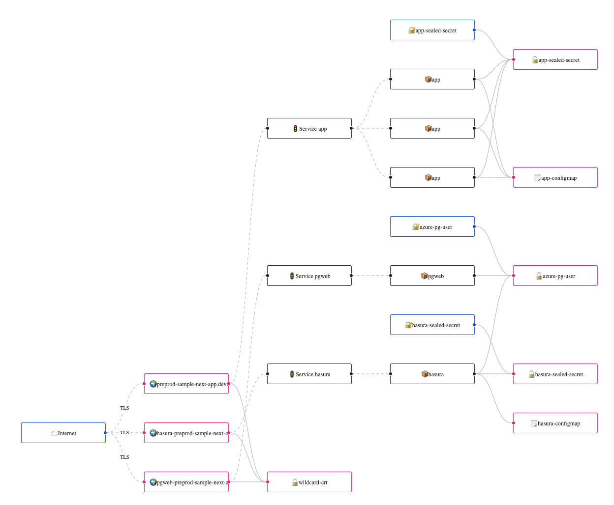

# @socialgouv/react-k8s-viewer

Render diagrams from your kubernetes manifests.

Use [kubernetes-models-ts](https://github.com/tommy351/kubernetes-models-ts), [react-flow](https://reactflow.dev/) and [dagre](https://github.com/dagrejs/dagre) for layouting.

See demo : https://socialgouv.github.io/react-k8s-viewer



## Usage

`K8sViewer` expect a list of `Manifest` or a `ManifestList` as JSON

```js
import { K8sViewer } from "@socialgouv/react-k8s-viewer";

import manifests from "./manifests.json";

const App = () => (
  <div style={{ width: 1000, height: 400 }}>
    <K8sViewer manifests={manifests} />
  </div>
);
```

To extract the manifests from some namespace:

```sh
kubectl --namespace some-app get deploy,ing,service,secret,sealedsecret,configmap -ojson > manifests.json
```

## Todo:

- handle multiple namespaces

